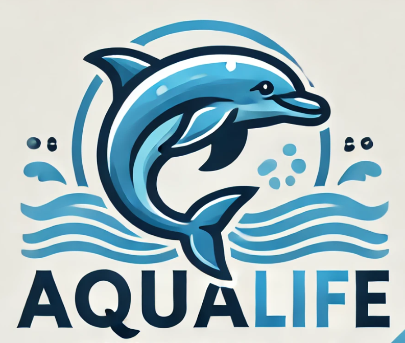
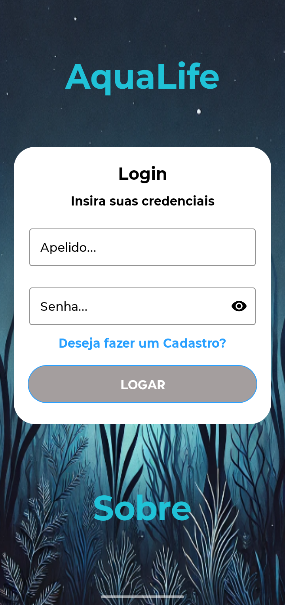
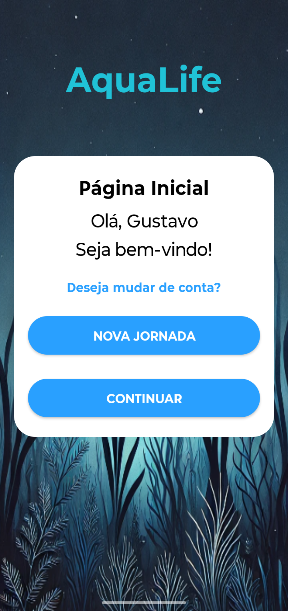
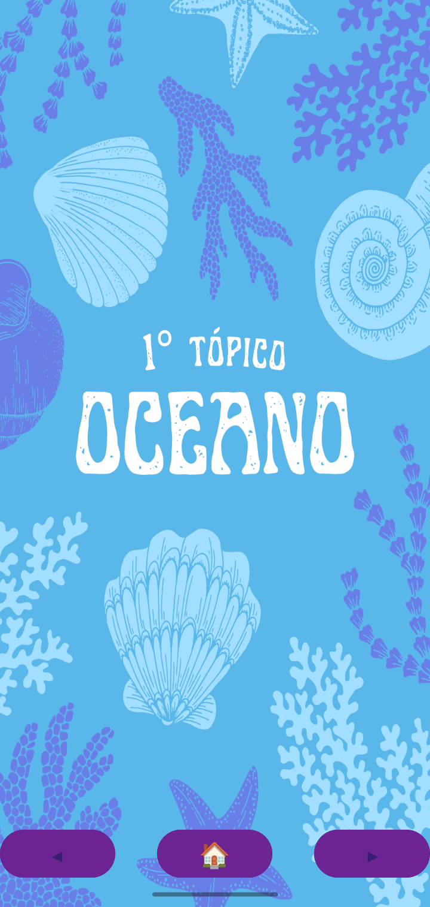
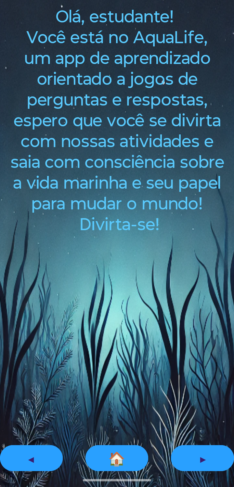
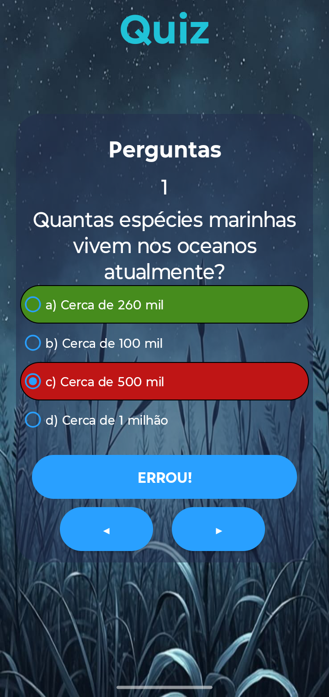

    

# 🐠 Aqua Life

**Um aplicativo Android focado em conscientização e conhecimento sobre animais marinhos e oceanos.**  

[➡️ Baixe o APK no GitHub em releases!]

---

## 📝 Sobre o projeto

**Aqua Life** é um aplicativo desenvolvido para informar e conscientizar sobre a vida marinha e os oceanos.  
Oferece conteúdos ricos em curiosidades, informações e quizzes para estimular o aprendizado de forma interativa.

---

## 🚀 Funcionalidades principais

✅ Textos com curiosidades e informações sobre oceanos e vida marinha  
✅ Quizes para testar o conhecimento adquirido  
✅ Interface amigável e intuitiva  
✅ Armazenamento local de progresso via **Shared Preferences**

---

## 🛠️ Tecnologias utilizadas

    

---

## 🌐 Como acessar

O aplicativo será disponibilizado em formato APK no GitHub para instalação manual.  

**Dica**: Permita a instalação de fontes desconhecidas no seu dispositivo para instalar o APK.

---

## 👨‍💻 Equipe de desenvolvimento

- Gustavo Mandu Ferreira Matori  
- Ryan Dias  
- Rafael  
- Clara Batista  

---

## 🎓 Projeto acadêmico

Desenvolvido como atividade da disciplina **Programação para Dispositivos Móveis** na **UNICID**, apresentado na **5ª Edição do WECTI** como critério de avaliação.

---

## 📷 Imagens

 
 

---

## 📄 Licença

Este projeto foi desenvolvido com fins **educacionais** e de **demonstração**.
